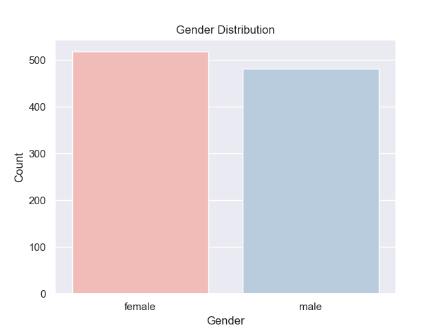
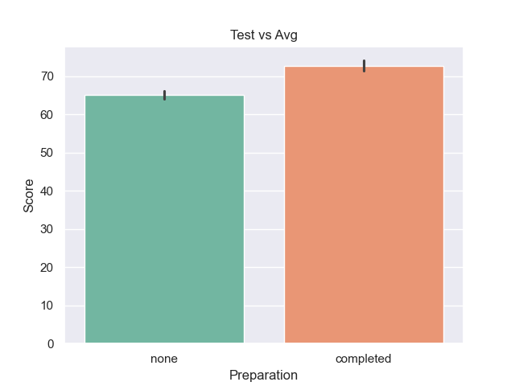
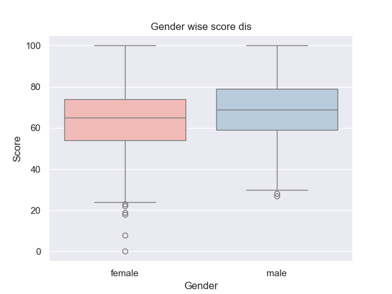
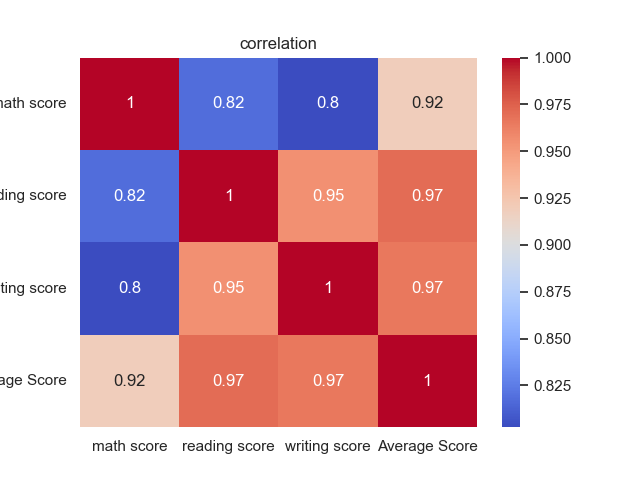
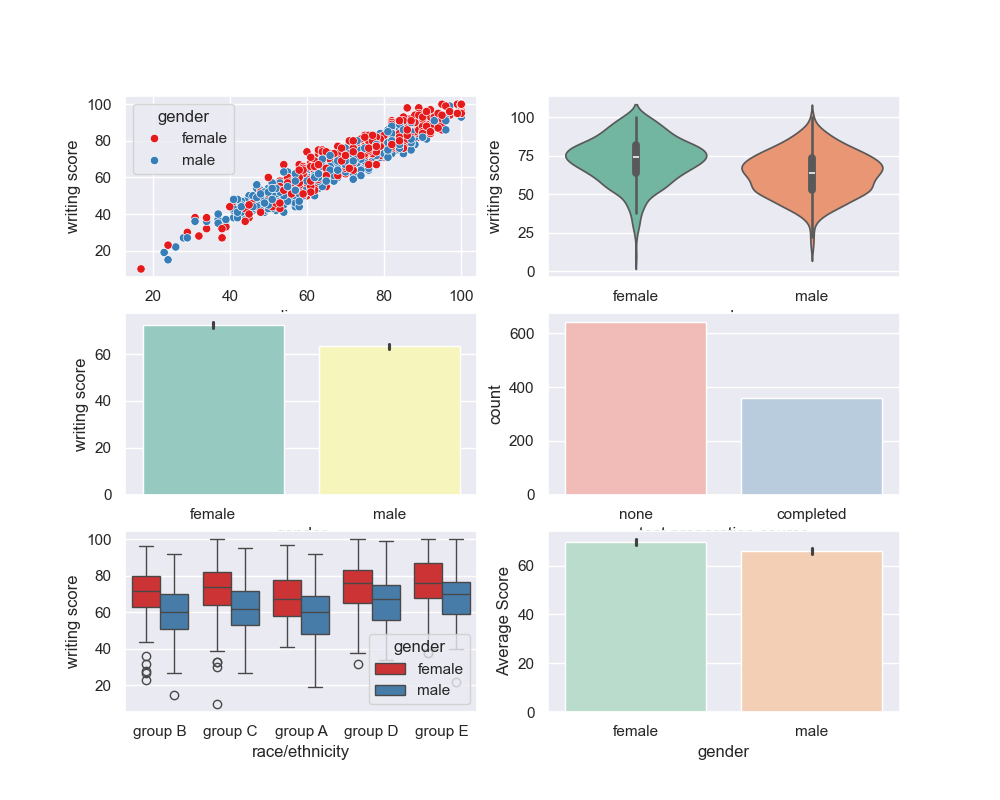

# student performance analysis

## 1. Gender Distribution

--Graph: Bar plot of gender count.

--Insight: Female students slightly outnumber male students.

## 2. Test Score vs Average

--Graph: Bar chart of average scores by test preparation status.

--Insight:

Students who completed test prep scored significantly higher than those who didn’t.

## 3. Gender wise score distribution

--Graph: Box plot of scores by gender.

--Insight:

Male students have a slightly higher median score.

Female students show more outliers on the lower end.

Male students exhibit a broader spread, indicating more variability.

## 4. Correlation

-- Correlation chart

--Insight:

Strong correlation between reading, writing, and average score (0.95+).

Math score is also highly correlated but slightly less so than reading/writing pair.

## 5. Subplots 

--Insight:

 subplots contatining scatter,voilin,bar,count,box plots

 Reading and writing scores are strongly related, and gender and test prepration slightly influene overall performance

